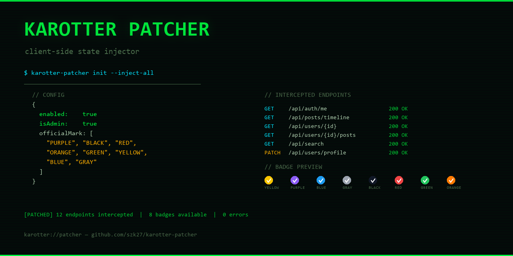

# karotter-patcher



[](LICENSE)
[](https://www.google.com/chrome/)

**karotter.com** のクライアント側 API レスポンスを書き換え、ユーザー状態を自由にパッチするブラウザ拡張機能です。`isAdmin` フラグの注入や `officialMark`（公式マーク）の付与を、ターミナル風の popup UI からリアルタイムに操作できます。

---

## 🎯 特徴

- 🔓 **isAdmin 注入** - 管理者フラグをワンタッチで付与
- 🏷️ **officialMark 付与** - 8 種類のバッジ（YELLOW / PURPLE / BLUE / GRAY / BLACK / RED / GREEN / ORANGE）を複数選択で表示
- 🔄 **全 API レスポンス対応** - fetch / XMLHttpRequest 両方を傍受し、全エンドポイントから自ユーザーを自動特定してパッチ
- ⚛️ **React State 直接パッチ** - Fiber ツリーを走査し、API 傍受だけでは対応できないクライアント側状態も書き換え
- 💻 **ターミナル風 UI** - CRT スキャンライン、リングロー、コンソールログ付きのハッカーツール風 popup
- 🌐 **マルチドメイン** - karotter.com / .jp / .karon.jp すべてに対応

---

## 📦 インストール

1. このリポジトリをクローンまたはダウンロード
   ```bash
   git clone https://github.com/kav0tter/karotter-patcher.git
   ```

2. Chrome の拡張機能ページ (`chrome://extensions/`) を開く

3. 右上の「デベロッパーモード」を有効化

4. 「パッケージ化されていない拡張機能を読み込む」をクリック

5. `karotter-patcher/chrome/` ディレクトリを選択

---

## 💡 使い方

1. karotter.com にログインする
2. ツールバーの拡張機能アイコンをクリックし、popup を開く
3. 各トグルを切り替える:

| 設定 | 説明 |
|------|------|
| **PATCH ENGINE** | パッチ全体の有効/無効 |
| **--admin** | `isAdmin: true` を注入 |
| **officialMark** | バッジの種類を複数選択（チップクリックで切替） |
| **--auto** | SPA ページ遷移時に自動で再パッチ |

4. 設定は即座に保存され、ページリロードなしで反映されます
5. popup 内蔵のコンソールに設定変更ログが表示されます

---

## 🏗️ アーキテクチャ

### 2 層 Content Scripts

Manifest V3 の `"world": "MAIN"` を活用し、ページコンテキストで直接動作するスクリプトと、拡張機能の isolated world で動作するブリッジスクリプトの 2 層構成です。

```
┌──────────────────────────────────────────────┐
│  popup.html / popup.js                       │
│  ターミナル風設定UI → chrome.storage.sync     │
└──────────────┬───────────────────────────────┘
               │ sendMessage
┌──────────────▼───────────────────────────────┐
│  content.js (ISOLATED world)                 │
│  chrome.storage 読み込み → postMessage       │
└──────────────┬───────────────────────────────┘
               │ window.postMessage
┌──────────────▼───────────────────────────────┐
│  patch.js (MAIN world)                       │
│  fetch/XHR 傍受 → レスポンス JSON 書き換え   │
│  React Fiber 走査 → state 直接パッチ         │
└──────────────────────────────────────────────┘
```

### パッチフロー

1. **fetch 傍受** (`document_start`): 全 `/api/` リクエストのレスポンスを傍受
2. **XHR 傍受**: `XMLHttpRequest.prototype.open/send` をフック
3. **ユーザー特定**: `/api/auth/me` から `username` を記録
4. **再帰スキャン**: JSON レスポンス全体を走査し、一致する `username` のオブジェクトに `isAdmin` / `officialMark` を注入
5. **React State パッチ**: Fiber ツリーの `memoizedState` から `{isAdmin, username}` を持つ state を探し、`dispatch` で直接書き換え
6. **SPA ナビゲーション追従**: `MutationObserver` でパス変更を検知し、自動で再パッチ

### ファイル構成

```
karotter-patcher/
├── chrome/
│   ├── manifest.json          # Manifest V3
│   ├── background.js          # バッジ状態管理
│   ├── content.js             # ISOLATED world 設定ブリッジ
│   ├── patch.js               # MAIN world パッチ本体
│   ├── popup.html             # ターミナル風設定UI
│   ├── popup.js               # 設定ロード/保存
│   └── icons/
│       ├── icon16.png
│       ├── icon48.png
│       └── icon128.png
├── gen_icons.py               # アイコン生成スクリプト
└── README.md
```

---

## 🎨 デザイン

popup UI は「ターミナル / ハッカーツール」をコンセプトに設計:

- CRT スキャンラインオーバーレイ + ビネット効果
- Phosphor green (#00ff41) のリングロー
- コマンドライン風フラグ表示（`--admin`, `--mark`, `--auto`）
- ステータスバーにドットアニメーション + インターセプト状態表示
- 内蔵コンソールログ（設定変更のリアルタイム記録）
- バッジチップに実際のチェックマークバッジ SVG を表示

---

## 📝 ライセンス

[MIT License](LICENSE)

```
Copyright (c) 2026 v
```

---

## 🤝 コントリビューション

バグ報告や機能提案は Issue で受け付けています。プルリクエストも歓迎します！

---

## 🔗 リンク

- [karotter.com](https://karotter.com/)
- [開発者プロフィール (@v0)](https://karotter.com/profile/v0)
- [GitHub リポジトリ](https://github.com/kav0tter/karotter-patcher)

---

**karotter Patcher** で、クライアント側の限界を超えろ。
